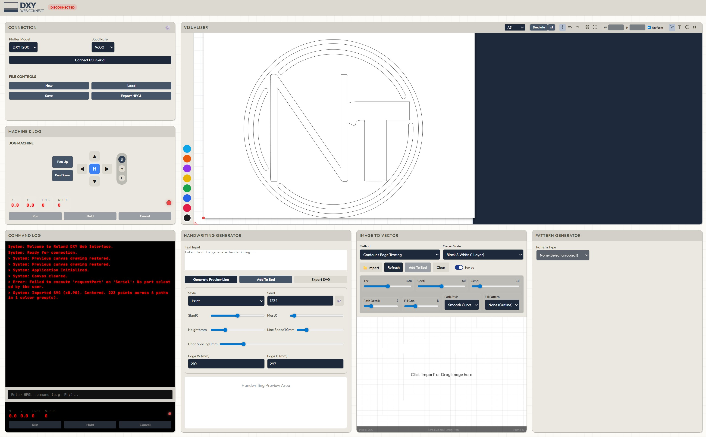

# Roland DXY Plotter Web UI

## Live Site

### [newtech-creative.github.io/Roland-DXY-Plotter-WebUI](https://newtech-creative.github.io/Roland-DXY-Plotter-WebUI/)

Browser-based Roland DXY plotter controller and creative HPGL workflow for the Roland DXY-1100, DXY-1200, and DXY-1300 series.

This project is a modern Roland DXY controller that combines drawing tools, HPGL generation, live preview, motion simulation, handwriting generation, image-to-vector conversion, advanced fill workflows, Live Tracker capture, and USB serial streaming in one web interface. It is designed for people searching for a Roland DXY web UI, Roland DXY controller, HPGL plotter software, or a browser-based pen plotter workflow using a CH340 USB-to-serial adapter.

Created by NEWTech Creative.

## Roland DXY Controller Features

- Connects to a Roland DXY plotter through a USB-to-serial CH340 adapter
- Creates and edits vector artwork directly in the browser
- Streams HPGL to the machine over serial
- Exports HPGL files for plotting later
- Simulates motion and previews pen paths before plotting
- Uses the same optimized plot order for simulation and real machine output
- Generates handwriting-style vector text
- Converts images into vector toolpaths
- Applies repeat patterns and advanced bucket-style fill patterns to closed regions
- Supports Live Tracker workflows for capturing and plotting live-drawn motion
- Includes a 3D vector tool workflow that is currently in development

## Main Features

### Roland Plotter Control

- Roland DXY connection panel with baud-rate setup
- Machine jog controls
- Command log with queue and position readout
- Live `Run`, `Hold`, and `Cancel` controls

### Drawing and Editing

- Select, text, shape, and node-edit tools
- Rectangle, circle, line, and vector path support
- Layered pen/color workflow
- Pattern generation and grouped artwork handling
- SVG import/export support for iterative vector workflows

### Live Tracker

- Live Tracker capture workflow for recording live movement into vector paths
- Tracker overlay support for aligning captured motion with the canvas
- Designed for rapid tracing, motion capture experiments, and plot-ready live drawing workflows

### Fill and Pattern Tools

- Paint bucket tool for filling exact closed regions with line art
- Advanced fill patterns including lines, crosshatch, curves, circles, topography, Japanese patterns, worms, pixel wave, zigzag, and improved serpentine joining
- Pen layer, spacing, angle, grouping, and plot-friendly pattern controls
- Fill preview aligned to the canvas workspace for more accurate placement
- Fill Debug SVG export to inspect detected regions, holes, and hovered fill targets

### Handwriting Generator

- Print, cursive, architect, and plotter styles
- Adjustable slant, messiness, line spacing, height, and character spacing
- Preview, export, and add-to-bed workflow

### Image to Vector

- Contour and tracing workflows
- Fill-gap generation
- Path style controls for curves or straight-line output
- SVG and raster-based creative vector conversion options

### HPGL Preview and Output

- Visualiser with pen layers and crosshair preview
- Motion simulation with multiple speed multipliers
- HPGL export for Roland-compatible workflows
- Optional use of DXY internal curve handling
- Plot-order optimization to reduce pen lifts and unnecessary travel
- Simulation route built from the same sequencing logic used for export and run-cut output

### 3D Vector Tools

- Experimental 3D vector workflow panel
- Import/export hooks for 3D-style vector exploration
- Currently in development and expected to evolve further

## Hardware Notes

This interface is designed around Roland DXY pen plotters and is intended to work with a USB-to-serial CH340 adapter.

Compatible search terms and hardware phrases people commonly use include:

- Roland DXY controller
- Roland DXY-1100 controller
- Roland DXY-1200 controller
- Roland DXY-1300 controller
- Roland DXY plotter software
- HPGL plotter controller
- pen plotter web interface
- CH340 Roland DXY adapter

The app also includes a startup/setup help reference for DIP switch configuration in:

- [References/Dip switch setup.svg](C:/Users/myles/OneDrive/NEWTech/Roland/WEB interface v2/References/Dip switch setup.svg)

## Use the Roland DXY Web UI

The easiest way to use the app is through the live GitHub Pages build:

[https://newtech-creative.github.io/Roland-DXY-Plotter-WebUI/](https://newtech-creative.github.io/Roland-DXY-Plotter-WebUI/)

For the best experience, use a Chromium-based browser with Web Serial support, then connect your CH340 serial adapter and use the `Connect USB Serial` button.

## Search-Friendly Summary

If you want a modern Roland DXY controller in the browser, this project provides a web-based HPGL workflow for Roland DXY plotters. It is useful for controlling older Roland DXY machines, creating pen plotter artwork, importing logos and vector graphics, generating handwriting, and sending HPGL through a CH340 USB serial connection.

## Project Structure

- `index.html`  
  Main app layout and panels
- `css/main.css`  
  Application styling
- `js/app.js`  
  App bootstrapping and settings
- `js/ui.js`  
  UI control wiring and panel behavior
- `js/canvas.js`  
  Drawing engine, editing tools, simulation, bucket fill, and preview
- `js/serial.js`  
  Serial communication and live run logic
- `js/hpgl.js`  
  HPGL parsing, generation, and export
- `js/image-vector`  
  Image vectorisation tools
- `js/handwriting`  
  Handwriting generation tools

## Compatibility

Built primarily for:

- Roland DXY-1100
- Roland DXY-1200
- Roland DXY-1300
- Other Roland DXY series plotters
- Web Serial capable desktop browsers
- Creative plotting workflows using HPGL

## Current Status

This is an actively evolving creative tool. Features and behavior are still being refined, especially around:

- advanced fill detection and pattern behavior
- handwriting style tuning
- Live Tracker workflow improvements
- live streaming behavior on different serial adapters
- 3D vector tooling
- imported vector edge cases

## Credits

Created by NEWTech Creative

- YouTube: [https://www.youtube.com/@NEWTechCreative](https://www.youtube.com/@NEWTechCreative)
- Support: [https://paypal.me/NEWTechCreative](https://paypal.me/NEWTechCreative)
